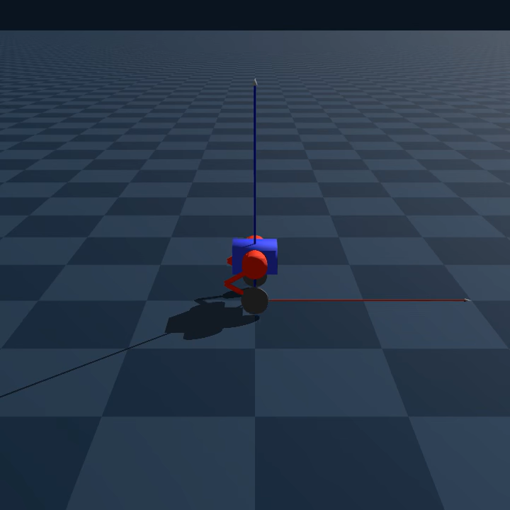
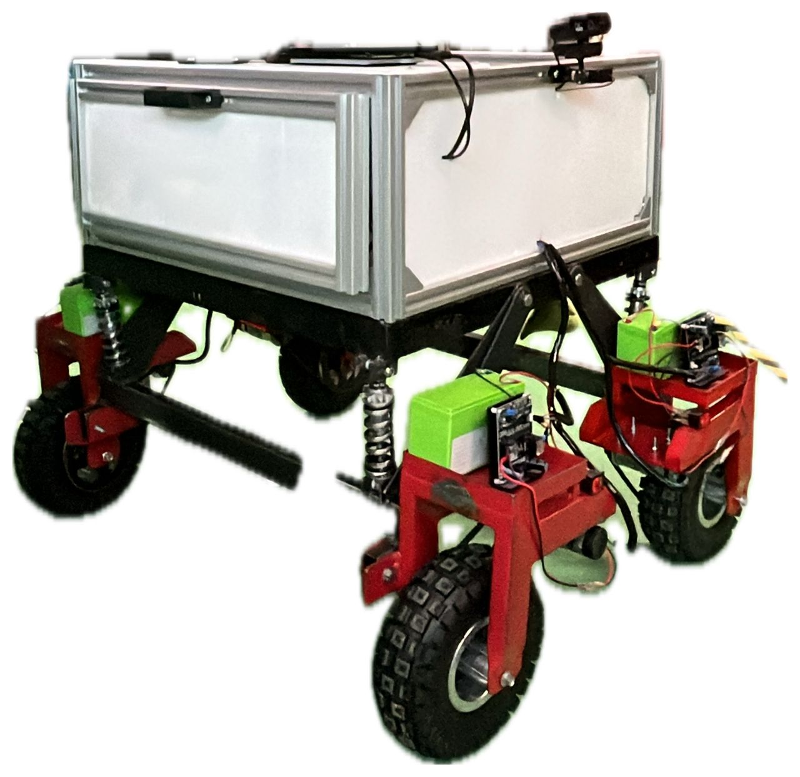

[Home](index.md) | [SWOT](swot.md) | [PO Attainment](po-attainment.md) | [Conclusion](conclusion.md)

<!-- ---
title: "Home"
--- -->

# Andrew Ng Chee Wei

Welcome to my personal portfolio! I’m a final-year Mechatronics Engineering student at Asia Pacific University, passionate about robotics, automation, and emerging intelligent systems.

---

## 👨‍💻 About Me

I am a goal-driven and highly motivated engineer, with a strong foundation in automation and robotics. My technical experience spans across Linux systems, embedded programming, real-time robot control, and advanced CAD modeling. I actively explore intersections between control theory, machine learning, and real-world robotic platforms. In fact, I aim to develop my own robots as a hobby as well. 

---

## 🛠️ Skills

- **Operating Systems:** Linux (Ubuntu/Debian-based)
- **Frameworks:** ROS2, Micro-ROS
- **Embedded Systems:** Arduino, ESP32, Teensy, STM32
- **Communication Protocols:** LoRa, UART, I2C, SPI
- **CAD:** SolidWorks -> Fusion 360 -> OnShape
- **Simulation:** Pybullet -> Genesis-Embodied-AI

---

## 💻 Programming Languages

- Python (RL, ROS2, Simulation)
- C++ (Embedded Systems, Control Systems)

---

## 🤖 Interests

1. Legged Robotics and Dynamic Locomotion  
2. Reinforcement Learning for Control  
3. Quasi-Direct Drive (QDD) Actuators  
4. Intelligent Digital Automation in Agriculture and Industry

---

## 🚀 Projects

| Project | Description | Technologies | Media |
|--------|-------------|--------------|--------------|
| [WERDNA](https://github.com/adwng/werdna_ros2) | A self-balancing two-wheeled robot running ROS2. This project has been my challenging project thus far. From 3D printing custom actuators to `custom hardware interfaces`, `custom broadcasters`, and `Sim2Real Transfer`. | ROS2, C++||
| [WERDNA-GYM](https://github.com/adwng/werdna_gensis) | Custom simulation environment based on Genesis-Embodied-AI framework for reinforcement learning with the WERDNA robot. | Genesis-Embodied-AI, Python, Gym, RL |  |
| [PalmVision AGV](https://github.com/adwng/PalmVision) | A smart AGV designed for palm oil fields. Combines low-cost sensors and navigation logic for real-time field coverage and automation. | Python, Computer Vision, Arduino, ROS2 || 

---

## 📬 Contact

- 📧 [andrewngcheewei@hotmail.com](mailto:andrewngcheewei@hotmail.com)  
- 🧠 [GitHub Profile](https://github.com/adwng)

---

If you'd like to learn more about my journey:

👉 [Read More →](swot.md)
